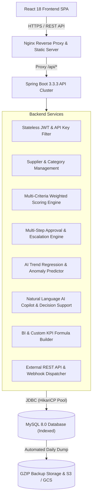

# Supplier Performance Rating System (SPRS)

[](https://www.oracle.com/java/)
[](https://spring.io/projects/spring-boot)
[](https://react.dev/)
[](https://vitejs.dev/)
[](https://tailwindcss.com/)
[](https://www.mysql.com/)
[](https://www.docker.com/)
[](https://opensource.org/licenses/MIT)

---

## 1. Overview & Problem Statement

Modern enterprise supply chain operations manage extensive networks of external suppliers, contractors, and raw material providers. However, organizations frequently lack a centralized, transparent, and quantifiable system to assess supplier delivery punctuality, quality standards, pricing competitiveness, and regulatory compliance.

The **Supplier Performance Rating System (SPRS)** is a full-stack, enterprise-grade software platform engineered to:
- Centralize supplier directory management and categorization.
- Automate multi-criteria weighted scoring evaluations with financial-grade precision (`BigDecimal`).
- Dynamically classify vendors into distinct performance tiers (`EXCELLENT`, `GOOD`, `AVERAGE`, `POOR`).
- Provide executive dashboards with real-time distribution analytics and AI-powered predictive risk scoring.
- Enable dedicated supplier self-service portals, dispute filing, and multi-step approval workflows.
- Facilitate B2B enterprise integrations via secure REST APIs, API keys, and HMAC signed webhooks.
- Provide automated database backup, point-in-time recovery (PITR), and multi-cloud disaster recovery architectures.

---

## 2. Tech Stack & Architecture

### Backend Architecture
- **Language**: Java 17+ (Eclipse Temurin LTS)
- **Framework**: Spring Boot 3.3.3
- **Persistence & ORM**: Spring Data JPA / Hibernate (with optimized multi-column indexes)
- **Security & Authorization**: Spring Security 6, JJWT (0.12.6), BCrypt, API Key Filter, Token Bucket Rate Limiting
- **API Documentation**: SpringDoc OpenAPI 3 / Swagger UI (2.6.0)
- **Export Engines**: OpenPDF (PDF generation), Apache POI 5.3 (Excel .xlsx), RFC-4180 CSV
- **Testing**: JUnit 5, Mockito, Spring Boot MockMvc, H2 In-Memory DB (269 automated tests)

### Frontend Architecture
- **Library**: React 18 SPA (with TypeScript & JSX)
- **Build Tool**: Vite (with dynamic route code splitting & Rollup chunk optimization)
- **Styling**: Tailwind CSS 3.4 (with PostCSS & Autoprefixer)
- **Routing**: React Router DOM v6
- **Data Visualization**: Chart.js & Recharts
- **Icons**: Lucide React
- **HTTP Client**: Axios (with Bearer Token Interceptors & auto-retry)
- **Testing**: Vitest & React Testing Library (41 automated component tests)

### Infrastructure & Operations
- **Production Database**: MySQL 8.0 (with HikariCP connection pool tuning)
- **Reverse Proxy & Web Server**: Nginx 1.27 Alpine (with security headers, GZIP, and SPA fallback)
- **Containerization**: Multi-stage Dockerfiles with non-root security (`spruser:sprgroup` UID 10001)
- **CI/CD**: GitHub Actions (`.github/workflows/ci-cd.yml`)
- **Disaster Recovery**: Automated single-transaction backup and restore scripts with 30-day retention pruning

---

## 3. Architecture Overview



---

## 4. Key Modules & Roadmap Completion (Phases 1–18)

| Phase | Capability | Description |
| :--- | :--- | :--- |
| **Phases 1–4** | **Core Architecture & Security** | Java 17 backend, React 18 frontend, MySQL schema, stateless JWT, and 4-tier RBAC (`ADMIN`, `MANAGER`, `EVALUATOR`, `SUPPLIER`). |
| **Phases 5–7** | **Supplier Directory & Scoring** | Supplier directory, dynamic criteria weights (100%), draft evaluations, and weighted score calculations. |
| **Phases 8–10** | **Rating Engine & Reporting** | Automatic tier grading (`EXCELLENT`, `GOOD`, `AVERAGE`, `POOR`), executive charts, and PDF/Excel/CSV exports. |
| **Phase 11** | **AI Supplier Intelligence** | Statistical trend regression, multi-factor risk scoring (0–100), and prescriptive remediation action generator. |
| **Phase 12** | **Notifications & Monitoring** | Multi-channel notifications (SSE stream + In-App), CAP tracking, and real-time operational pulse monitor (`/monitoring`). |
| **Phase 13** | **Supplier Portal** | Self-service vendor dashboard, scorecard review, document uploads, and dispute resolution workflows. |
| **Phase 14** | **Workflow & Approvals** | Multi-step sequential/parallel approval chains, SLA deadlines, automated escalations, and audit trails. |
| **Phase 15** | **Business Intelligence & KPI Builder** | Dynamic custom KPI formula builder, multi-dimensional BI reports, and executive dashboards. |
| **Phase 16** | **Enterprise Integrations** | Secure B2B external REST APIs (`/api/v1/external/**`), API key management, rate limiting, and HMAC-signed webhooks. |
| **Phase 17** | **Cloud Deployment & DR** | Multi-stage Dockerfiles, production Compose stack, backup/restore scripts, CI/CD pipeline, and Disaster Recovery plan. |
| **Phase 18** | **AI Copilot & Decision Support** | Natural language conversational analytics, RBAC data isolation, multi-supplier AI comparison, human-in-the-loop governance, and C-suite briefings. |


---

## 5. Quick-Start Production Deployment

### Prerequisites
- Docker 24.0+ and Docker Compose 2.20+
- Java JDK 17+ and Node.js 20+ (for local development)

### Launching with Docker Compose
```bash
# 1. Clone repository
git clone https://github.com/priyanselvaraj/Supplier-Performance-Rating-System.git
cd "Supplier-Performance-Rating-System"

# 2. Setup environment variables
cp deploy/.env.example deploy/.env

# 3. Build and launch production stack
docker compose -f deploy/docker-compose.prod.yml --env-file deploy/.env up -d --build

# 4. Verify running health status
docker compose -f deploy/docker-compose.prod.yml ps
```

The application will be accessible at:
- **Web Frontend**: [http://localhost](http://localhost) (or port 5173 in dev)
- **Backend REST API**: [http://localhost:8080/api/v1](http://localhost:8080/api/v1)
- **Swagger Documentation**: [http://localhost:8080/swagger-ui.html](http://localhost:8080/swagger-ui.html)
- **Actuator Health**: [http://localhost:8080/actuator/health](http://localhost:8080/actuator/health)

---

## 6. Pre-Seeded Demo Credentials

| Role | Username | Password | Access Scope |
| :--- | :--- | :--- | :--- |
| **System Administrator** | `admin` | `Admin@12345` | Complete system control, users, criteria, workflows, integrations |
| **Procurement Manager** | `manager` | `Manager@12345` | Supplier management, evaluations, approvals, reports |
| **Supplier Contact** | `supplier_user` | `Supplier@12345` | Vendor portal, scorecards, disputes, CAP actions |

---

## 7. Automated Testing & Quality Assurance

### Backend Test Suite (259 Tests — 100% Pass Rate)
```bash
cd backend
mvn clean test
```
- **198 Service & Utility Unit Tests**: Business rules, formulas, token bucket limiters, HMAC signatures, AI algorithms.
- **60 Controller & MockMvc Integration Tests**: REST endpoints, RBAC enforcement, API key validation, exception handling.
- **1 Application Context Test**: `SprSystemApplicationTests`.

### Frontend Test Suite (38 Tests — 100% Pass Rate)
```bash
cd frontend
npm test -- --run
```
- Component unit tests for UI controls, authentication forms, rating badges, modals, and tables.

### Frontend Production Build
```bash
cd frontend
npm run build
```
- Clean build with zero warnings or errors.

---

## 8. Comprehensive Documentation Index

All detailed architecture, deployment, disaster recovery, and operational guides are available in the [`docs/`](docs/) directory:

- [Final Architecture Specification](docs/FINAL_ARCHITECTURE.md): Full-stack design, component interactions, and scalability model.
- [Cloud Deployment & Scalability Guide](docs/CLOUD_DEPLOYMENT.md): Reference architectures for AWS, GCP, and Azure.
- [Production Deployment Guide](docs/DEPLOYMENT_GUIDE.md): Operations manual, rolling zero-downtime updates, and logging.
- [Database Backup and Recovery Guide](docs/DATABASE_BACKUP_AND_RECOVERY.md): Backup automation, scripts, and PITR.
- [Disaster Recovery Plan (DRP)](docs/DISASTER_RECOVERY_PLAN.md): RTO/RPO targets, failover runbooks, and continuity protocols.
- [Enterprise Integrations & Webhooks](docs/ENTERPRISE_INTEGRATIONS.md): B2B external APIs, HMAC webhooks, and rate limiting.
- [External REST API Guide](docs/EXTERNAL_API_GUIDE.md): Request payloads, headers, and code examples.
- [Business Intelligence & KPI Builder](docs/BUSINESS_INTELLIGENCE.md): BI aggregation, cohort analytics, and KPI formulas.
- [Workflow & Approval Management](docs/WORKFLOW_MANAGEMENT.md): Multi-step approval workflows, SLAs, and escalations.
- [Supplier Portal Guide](docs/SUPPLIER_PORTAL.md): Vendor onboarding, dispute filing, and self-service scorecards.
- [AI Intelligence & Predictive Analytics](docs/AI_INTELLIGENCE.md): Linear regression forecasting, anomaly alerts, and risk scoring.
- [Notifications & Real-Time Monitoring](docs/NOTIFICATIONS.md): Multi-channel events, SSE stream architecture.
- [Email & Login Notifications Guide](docs/EMAIL_NOTIFICATIONS.md): SMTP configuration, Gmail App Password setup, login security alerts, and error isolation.
- [Supplier Improvement Actions](docs/IMPROVEMENT_ACTIONS.md): Corrective Action Plans (CAP) and AI remediation.
- [API Overview](docs/API_OVERVIEW.md): Summary of all REST endpoints, HTTP methods, and RBAC permissions.
- [Demo & Viva Presentation Guide](docs/DEMO_GUIDE.md): 10-step evaluation and demonstration flow.

---

## 9. License

This project is licensed under the terms of the [MIT License](LICENSE).
