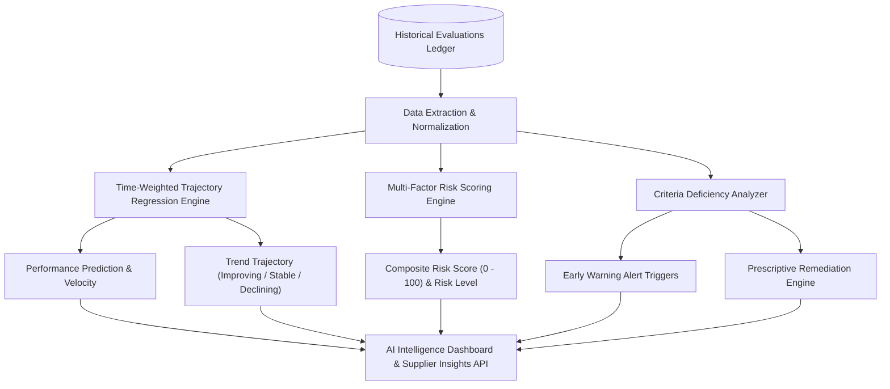

# AI-Powered Supplier Intelligence & Predictive Analytics

The **Supplier Performance Rating System (SPRS)** incorporates a transparent, explainable **AI & Predictive Analytics Engine** designed to assist procurement teams in forecasting vendor performance, anticipating operational risks, detecting early warning signals, and executing prescriptive remediation plans.

> [!IMPORTANT]
> **Decision Support Notice**: This module provides statistical forecasting and risk scoring based on historical evaluation records. It serves as an assistive decision-support tool and should not replace human executive procurement judgment.

---

## 🏗️ 1. Architecture & Intelligence Pipeline



---

## 🔮 2. Predictive Forecasting Strategy

### Mathematical Model: Time-Weighted Linear Regression
Rather than relying on uninterpretable "black box" models, SPRS employs **Time-Weighted Linear Trajectory Regression**:
- Let $y_1, y_2, \dots, y_N$ be the historical evaluation scores ordered chronologically at index $x_i = i$.
- More recent evaluation cycles receive proportionally higher weights: $w_i = i$.
- The weighted slope $m$ represents the **trajectory velocity** (points per evaluation cycle):

$$m = \frac{\sum_{i=1}^N w_i (x_i - \bar{x}_w)(y_i - \bar{y}_w)}{\sum_{i=1}^N w_i (x_i - \bar{x}_w)^2}$$

- The forecasted score for cycle $N+1$ is calculated as:

$$\hat{y}_{N+1} = \text{clamp}(y_N + m, 0.0, 100.0)$$

### Data Sufficiency & Confidence Levels
- **Minimum Data Requirement**: At least **3 completed evaluation cycles** ($N \ge 3$) are required to generate a statistical prediction.
- If $N < 3$:
  - Status: `"Insufficient historical data for prediction (minimum 3 required)."`
  - `predictedScore = null`
  - `confidence = LOW`
  - `trend = INSUFFICIENT_DATA`
- **Confidence Rating**:
  - $N \ge 5 \implies$ **HIGH Confidence**
  - $3 \le N < 5 \implies$ **MEDIUM Confidence**
  - $N < 3 \implies$ **LOW Confidence**

---

## 🛡️ 3. Supplier Risk Scoring & Levels

The system calculates a composite **Risk Score (0.0 to 100.0)** derived from observable operational performance indicators:

| Factor | Calculation Impact |
| :--- | :--- |
| **Base Score Deficit** | $(100.0 - \text{overallRating}) \times 0.50$ (Up to 50 base risk points) |
| **Declining Trajectory** | $+15.0$ to $+20.0$ points if recent evaluations exhibit downward trajectory |
| **Sharp Score Drop** | $+15.0$ points if drop between consecutive evaluations $\ge 5.0$ points |
| **Severe Criterion Deficiency** | $+10.0$ points if any core criterion (Quality / Delivery) $< 60.0\%$ |
| **History Uncertainty** | $+10.0$ points if vendor has $< 2$ total evaluations |
| **Improving Trajectory** | $-10.0$ points credit for sustained upward performance |

### Risk Level Tiers
- **CRITICAL**: $\text{Risk Score} \ge 75.0$
- **HIGH**: $50.0 \le \text{Risk Score} < 75.0$
- **MEDIUM**: $25.0 \le \text{Risk Score} < 50.0$
- **LOW**: $\text{Risk Score} < 25.0$

---

## 🚨 4. Early Warning Alert Triggers

The system continuously scans evaluations against automated early warning rules:

| Alert Type | Trigger Condition | Severity |
| :--- | :--- | :--- |
| `PERFORMANCE_DECLINE` | Score dropped $\ge 10.0$ points from previous cycle. | `CRITICAL` (if drop $\ge 15.0$) / `WARNING` |
| `LOW_PERFORMANCE` | Overall rating falls below configured threshold ($< 70.0\%$). | `CRITICAL` (if $< 50.0\%$) / `HIGH` |
| `REPEATED_POOR_PERFORMANCE` | Consecutive evaluations in `POOR` or `AVERAGE` tiers. | `CRITICAL` |
| `HIGH_RISK_SUPPLIER` | Calculated risk score $\ge 60.0$. | `HIGH` / `CRITICAL` |

---

## 💡 5. Prescriptive Remediation Engine

When individual evaluation criteria score $< 75.0\%$, the AI engine generates targeted, contextual action plans:

- **Quality Deficiencies**: Mandates ISO-9001 quality audits, root cause analysis (RCA), and pre-shipment gate inspection.
- **Delivery Delays**: Recommends SLA transit lead-time audits, automated freight tracking, and buffer inventory adjustments.
- **Pricing & Cost**: Triggers raw material benchmark analysis, volume tiered rebates, and invoice surcharges audits.
- **Account Management**: Recommends bi-weekly governance cadences and Tier-1 dedicated support escalation channels.

---

## ⚙️ 6. Configuration Parameters

Configured in `backend/src/main/resources/application.yml`:

```yaml
app:
  ai:
    minimum-history: ${AI_MINIMUM_HISTORY:3}
    high-risk-threshold: ${AI_HIGH_RISK_THRESHOLD:50.0}
    critical-risk-threshold: ${AI_CRITICAL_RISK_THRESHOLD:75.0}
    decline-threshold: ${AI_DECLINE_THRESHOLD:5.0}
    low-score-threshold: ${AI_LOW_SCORE_THRESHOLD:70.0}
```
