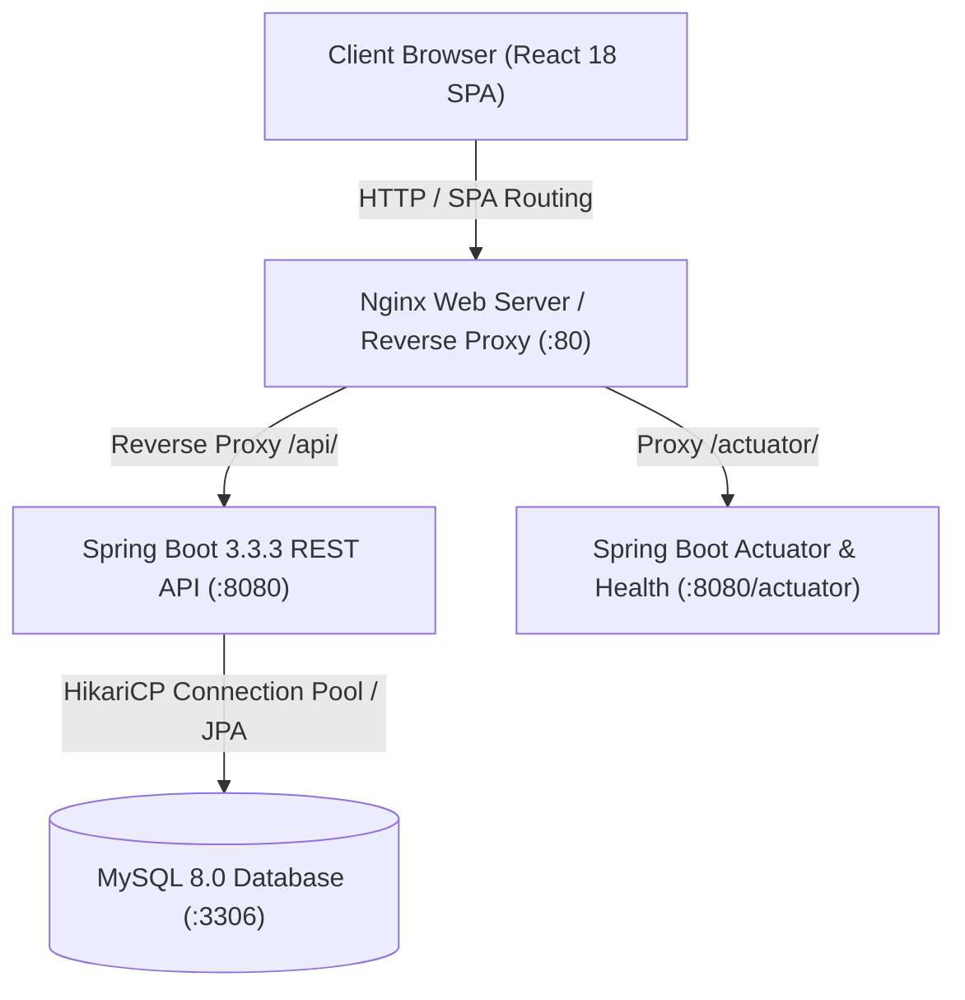
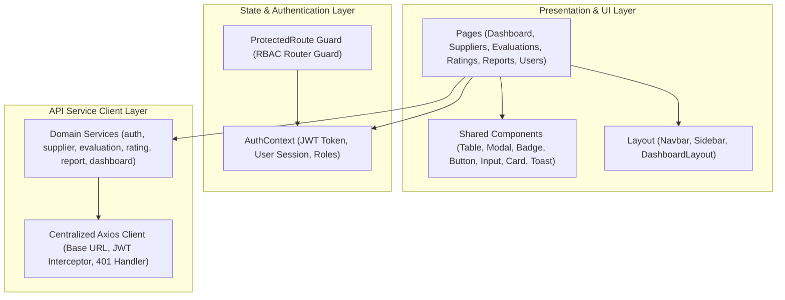
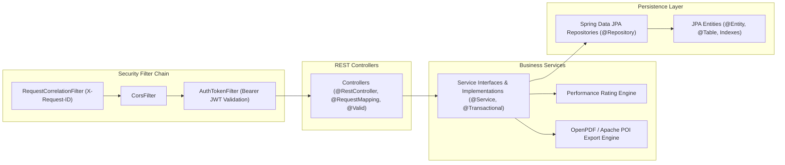
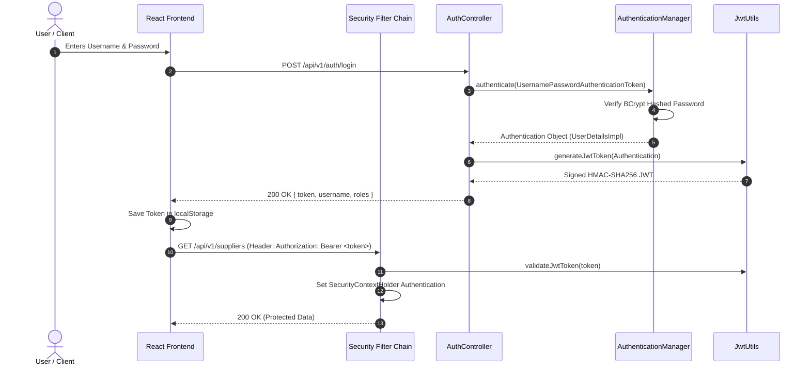
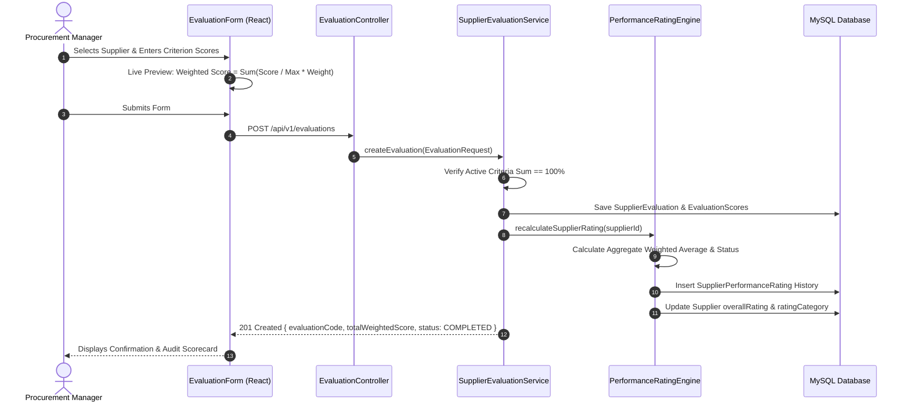

# Supplier Performance Rating System (SPRS) — Architecture Documentation

This document describes the architectural design, layered patterns, security model, and data flow of the **Supplier Performance Rating System (SPRS)**.

---

## 1. High-Level System Architecture

The application adopts a **Modern 3-Tier Client-Server Architecture** designed for high modularity, horizontal scalability, and strict separation of concerns.

---

## 2. Frontend Layered Architecture (React 18 + Vite)

The frontend is constructed as a responsive Single Page Application (SPA) structured around modular domain components:

---

## 3. Backend Layered Architecture (Spring Boot 3.3.3)

The backend strictly enforces the **Controller-Service-Repository Pattern** with stateless JWT authentication:

---

## 4. Authentication & JWT Token Flow

---

## 5. Evaluation & Performance Scoring Flow

---

## 6. Database Schema & Indexing Strategy

Indexes are applied on frequently filtered and joined columns to optimize query execution plans:

| Table | Index Name | Indexed Columns | Justification |
| :--- | :--- | :--- | :--- |
| `suppliers` | `idx_suppliers_category_id` | `category_id` | Foreign key joins during category filtering |
| `suppliers` | `idx_suppliers_status` | `status` | Filter by `ACTIVE`, `INACTIVE` |
| `suppliers` | `idx_suppliers_rating_cat` | `rating_category` | High/Low performance categorization queries |
| `suppliers` | `idx_suppliers_name` | `name` | Case-insensitive multi-attribute text search |
| `supplier_evaluations` | `idx_eval_supplier_id` | `supplier_id` | History lookup by supplier |
| `supplier_evaluations` | `idx_eval_evaluator_id` | `evaluator_id` | `getMyEvaluations()` audit lookup |
| `supplier_evaluations` | `idx_eval_date` | `evaluation_date` | Date-range filtering and analytics sorting |
| `supplier_evaluations` | `idx_eval_status` | `status` | Draft vs Completed filtering |
| `supplier_performance_ratings` | `idx_spr_supplier_id` | `supplier_id` | Rating progression timeline queries |
| `supplier_performance_ratings` | `idx_spr_rating_date` | `rating_date` | Monthly/Quarterly/Annual trend aggregation |
| `evaluation_scores` | `idx_eval_score_eval_id`| `evaluation_id` | Scorecard item retrieval |
| `users` | `idx_users_active` | `active` | User status queries |
