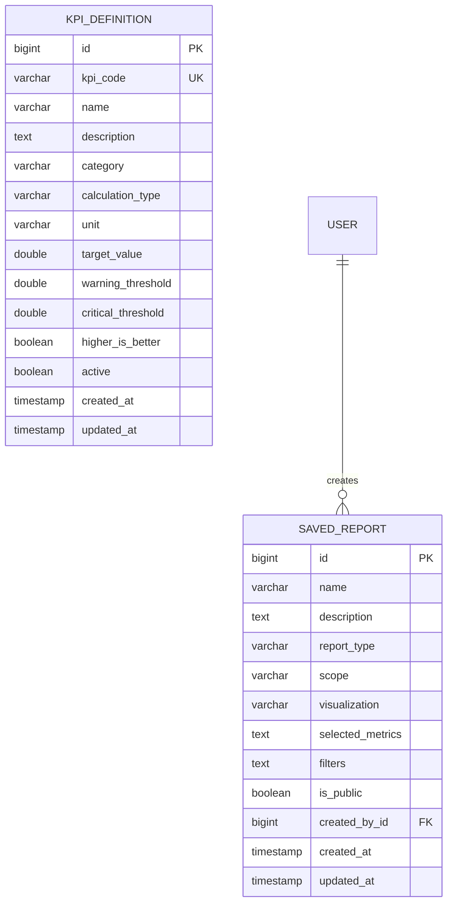

# Phase 15: Advanced Reporting, Business Intelligence, and KPI Builder

## 1. Executive Summary & Overview
Phase 15 introduces a comprehensive Business Intelligence (BI), KPI Governance, and Executive Analytics subsystem to the Supplier Performance Rating System (SPRS). It empowers executives, procurement managers, and administrators to extract high-value strategic intelligence from live database records without data fabrication or mock data.

### Key Capabilities:
- **Configurable KPI Governance Engine**: Dynamic definition of mathematical KPIs, measurement units, target thresholds, warning/critical bands, and calculation directions.
- **Executive Strategic Dashboard (`/executive-dashboard`)**: High-level C-Suite overview aggregating supply chain risk profiles, vendor performance dynamics, CAP closure rates, and AI strategic recommendations.
- **Business Intelligence & KPI Hub (`/business-intelligence`)**: Real-time scorecards, operational health indicators, rating tier distribution, and category breakdowns.
- **Multi-Supplier Comparative Intelligence (`/business-intelligence/supplier-comparison`)**: Side-by-side multi-criteria comparison of 2 to 5 suppliers with criteria radar/bar charts, delta matrices, and risk scoring.
- **Enterprise & Category Benchmarking (`/business-intelligence/benchmarks`)**: Percentile ranking against category and enterprise datasets, percentile placement, strengths, and improvement gaps.
- **Dynamic Report Builder (`/business-intelligence/report-builder`)**: Ad-hoc query builder with custom dimensions, metric filters, live interactive visualization previews (Bar, Line, Doughnut, Table), and instant CSV/PDF export capabilities.
- **Saved Reports Gallery (`/business-intelligence/saved-reports`)**: User-isolated repository for public and private report blueprints with 1-click execution.
- **Administrative KPI Threshold Manager (`/admin/kpis`)**: Full administrative lifecycle management (Create, Read, Update, Delete, Toggle Active, and Live Engine Test).

---

## 2. Architecture & Data Model

### 2.1 Entity Relationships


### 2.2 Calculation Engine Models (`KpiCalculationType`)
1. `AVERAGE_RATING`: Overall mean score of all active supplier ratings.
2. `CRITERIA_SCORE_AVG`: Mean score across individual criteria evaluations.
3. `ON_TIME_DELIVERY_RATE`: Calculated delivery performance score.
4. `QUALITY_ACCEPTANCE_RATE`: Computed quality assurance score.
5. `COMPLIANCE_RATE`: Calculated regulatory/audit compliance score.
6. `HIGH_RISK_SUPPLIER_COUNT`: Aggregation of suppliers in `HIGH` or `CRITICAL` risk tiers.
7. `CAP_CLOSURE_RATE`: Percentage of Corrective Action Plans (CAPs) resolved vs total created (`(RESOLVED + VERIFIED + CLOSED) / TOTAL * 100`).
8. `PENDING_APPROVALS_COUNT`: Real-time count of pending multi-level approval tasks.
9. `ESCALATED_WORKFLOWS_COUNT`: Real-time count of escalated workflow instances.
10. `ACTIVE_SUPPLIERS_COUNT`: Count of approved active suppliers.

### 2.3 KPI Threshold Determination Algorithm
Given:
- `currentValue`: Computed database aggregation.
- `targetValue`: Configured target baseline.
- `warningThreshold`: Warning threshold boundary.
- `criticalThreshold`: Critical threshold boundary.
- `higherIsBetter`: Direction boolean flag.

```
If higherIsBetter == true:
    If currentValue >= targetValue        -> Status = GOOD
    Else If currentValue >= warningThreshold -> Status = WARNING
    Else                                  -> Status = CRITICAL

If higherIsBetter == false:
    If currentValue <= targetValue        -> Status = GOOD
    Else If currentValue <= warningThreshold -> Status = WARNING
    Else                                  -> Status = CRITICAL
```

---

## 3. REST API Specification

### 3.1 Business Intelligence & Executive Endpoints (`/api/v1/bi`)

| Method | Endpoint | Description | Access Level |
|---|---|---|---|
| `GET` | `/api/v1/bi/dashboard` | Aggregated executive KPI summary & charts | All Authenticated |
| `GET` | `/api/v1/bi/executive/dashboard` | C-Suite strategic overview & AI insights | `ROLE_ADMIN`, `ROLE_MANAGER`, `ROLE_EXECUTIVE` |
| `GET` | `/api/v1/bi/kpis/calculate` | Compute status for all active KPIs | All Authenticated |
| `GET` | `/api/v1/bi/kpis/calculate/{code}` | Compute status for specific KPI by code | All Authenticated |
| `GET` | `/api/v1/bi/kpis/calculate/id/{id}` | Compute status for specific KPI by ID | All Authenticated |
| `POST` | `/api/v1/bi/supplier-comparison` | Multi-supplier comparative matrix (2-5 vendors) | All Authenticated |
| `GET` | `/api/v1/bi/benchmarks/supplier/{id}` | Category & enterprise percentile benchmarking | All Authenticated |
| `POST` | `/api/v1/bi/reports/preview` | Generate live preview dataset for custom report | All Authenticated |
| `GET` | `/api/v1/bi/saved-reports` | List accessible saved report blueprints | All Authenticated |
| `GET` | `/api/v1/bi/saved-reports/{id}` | Retrieve specific saved report definition | All Authenticated |
| `POST` | `/api/v1/bi/saved-reports` | Save new custom report blueprint | All Authenticated |
| `PUT` | `/api/v1/bi/saved-reports/{id}` | Update existing saved report (Owner/Admin) | Owner or `ROLE_ADMIN` |
| `DELETE` | `/api/v1/bi/saved-reports/{id}` | Delete saved report (Owner/Admin) | Owner or `ROLE_ADMIN` |

### 3.2 Administrative KPI Governance Endpoints (`/api/v1/admin/kpis`)

| Method | Endpoint | Description | Access Level |
|---|---|---|---|
| `GET` | `/api/v1/admin/kpis` | List all KPI definitions | `ROLE_ADMIN` |
| `GET` | `/api/v1/admin/kpis/{id}` | Get KPI definition by ID | `ROLE_ADMIN` |
| `POST` | `/api/v1/admin/kpis` | Create new KPI definition | `ROLE_ADMIN` |
| `PUT` | `/api/v1/admin/kpis/{id}` | Update KPI thresholds and formulas | `ROLE_ADMIN` |
| `PATCH` | `/api/v1/admin/kpis/{id}/toggle` | Toggle KPI active status | `ROLE_ADMIN` |
| `DELETE` | `/api/v1/admin/kpis/{id}` | Delete KPI definition | `ROLE_ADMIN` |

---

## 4. Frontend Modules & Navigation

### 4.1 Route Registry
| Route | Component | Purpose |
|---|---|---|
| `/executive-dashboard` | `ExecutiveDashboard.jsx` | C-Suite risk, performance, operational & strategic view |
| `/business-intelligence` | `BiDashboard.jsx` | Operational KPI dashboard & distribution analytics |
| `/business-intelligence/supplier-comparison` | `SupplierComparison.jsx` | 2-5 supplier side-by-side radar/bar matrix |
| `/business-intelligence/benchmarks` | `PerformanceBenchmarking.jsx` | Category/Enterprise percentile rankings & gap analysis |
| `/business-intelligence/report-builder` | `ReportBuilder.jsx` | Interactive ad-hoc query designer & live preview |
| `/business-intelligence/saved-reports` | `SavedReports.jsx` | 1-click execution gallery with public/private filtering |
| `/admin/kpis` | `KpiAdmin.jsx` | KPI definition, threshold configuration & test bench |

### 4.2 Security & Data Isolation
- **Saved Reports Isolation**: Non-admin users can only view their own private reports and all public blueprints. Updates and deletions enforce strict ownership checks (`report.createdBy == currentUser || isAdmin`).
- **Administrative Governance**: KPI threshold creation, modification, and deletion are protected by Spring Security `@PreAuthorize("hasRole('ADMIN')")` and React `ProtectedRoute requiredRole="ADMIN"`.

---

## 5. Verification & Testing

### 5.1 Automated Backend Tests
- `KpiServiceTest`: Tests dynamic threshold evaluation, math formulas, active filtering, and validation rules.
- `BusinessIntelligenceServiceTest`: Tests supplier comparison, percentile rank distribution, dynamic report compilation, and executive overview aggregation.
- **Backend Result**: 241 unit/integration tests executed with **0 failures, 0 errors, 0 skipped**.

### 5.2 Automated Frontend Tests
- `BusinessIntelligence.test.jsx`: Complete component mounting, mock service integration, live chart rendering, and RBAC verification.
- **Frontend Result**: 31 unit/component tests executed with **0 failures**.
- **Production Build**: `npm run build` completed successfully in 3.27s.
