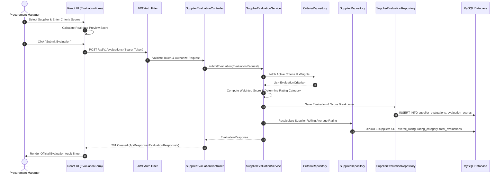

# System Architecture Diagram

## 1. High-Level System Architecture

The **Supplier Performance Rating System (SPRS)** is designed following enterprise 3-tier architecture patterns with strict separation of concerns, stateless security, and clean domain boundaries.

```mermaid
flowchart TD
    subgraph Client Tier ["Client Tier (Browser / SPA)"]
        UI["React 18 + Vite + Tailwind CSS"]
        Router["React Router v6"]
        AxiosClient["Axios HTTP Client with JWT Interceptors"]
        UI --> Router --> AxiosClient
    end

    subgraph Security & Gateway ["API & Security Gateway"]
        CORS["CORS Filter"]
        JWTFilter["AuthTokenFilter (JWT Validation)"]
        SecContext["Spring Security Context (RBAC)"]
        CORS --> JWTFilter --> SecContext
    end

    subgraph Controller Tier ["REST Controller Layer (Spring Web)"]
        AuthCtrl["AuthController (/api/v1/auth)"]
        UserCtrl["UserController (/api/v1/users)"]
        SupCtrl["SupplierController (/api/v1/suppliers)"]
        CatCtrl["CategoryController (/api/v1/categories)"]
        CritCtrl["CriteriaController (/api/v1/criteria)"]
        EvalCtrl["EvaluationController (/api/v1/evaluations)"]
        DashCtrl["DashboardController (/api/v1/dashboard)"]
        RepCtrl["ReportController (/api/v1/reports)"]
        HealthCtrl["HealthController (/api/health)"]
    end

    subgraph Service Tier ["Business Logic Layer"]
        AuthSvc["AuthService / UserDetailsServiceImpl"]
        UserSvc["UserService"]
        SupSvc["SupplierService"]
        CatSvc["SupplierCategoryService"]
        CritSvc["EvaluationCriteriaService"]
        EvalSvc["SupplierEvaluationService (Weighted Score Engine)"]
        DashSvc["DashboardService"]
        RepSvc["ReportService"]
    end

    subgraph Data Access Tier ["Spring Data JPA Repositories"]
        UserRepo["UserRepository"]
        RoleRepo["RoleRepository"]
        SupRepo["SupplierRepository"]
        CatRepo["SupplierCategoryRepository"]
        CritRepo["EvaluationCriteriaRepository"]
        EvalRepo["SupplierEvaluationRepository"]
        ScoreRepo["EvaluationScoreRepository"]
    end

    subgraph Database Tier ["Persistence Layer"]
        MySQL[("MySQL 8 Production DB / H2 In-Memory Dev DB")]
    end

    AxiosClient -- "HTTPS / JSON + Bearer Token" --> CORS
    SecContext --> Controller Tier
    
    AuthCtrl --> AuthSvc
    UserCtrl --> UserSvc
    SupCtrl --> SupSvc
    CatCtrl --> CatSvc
    CritCtrl --> CritSvc
    EvalCtrl --> EvalSvc
    DashCtrl --> DashSvc
    RepCtrl --> RepSvc

    AuthSvc --> UserRepo & RoleRepo
    UserSvc --> UserRepo & RoleRepo
    SupSvc --> SupRepo & CatRepo
    CatSvc --> CatRepo
    CritSvc --> CritRepo
    EvalSvc --> EvalRepo & SupRepo & CritRepo & UserRepo
    DashSvc --> SupRepo & EvalRepo
    RepSvc --> SupRepo & EvalRepo

    UserRepo & RoleRepo & SupRepo & CatRepo & CritRepo & EvalRepo & ScoreRepo --> MySQL
```

---

## 2. Component Interaction & Evaluation Flow


