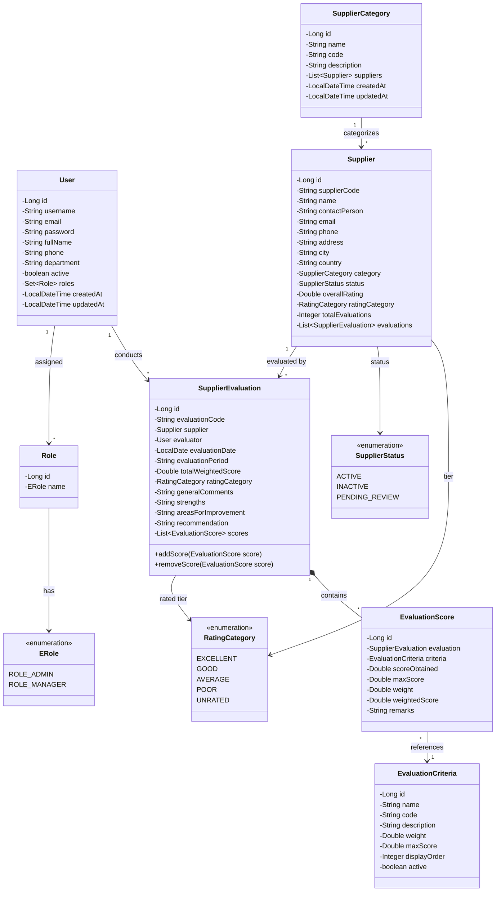

# Class Diagram

## 1. Domain Model Class Structure

```mermaid
classDiagram
    class User {
        -Long id
        -String username
        -String email
        -String password
        -String fullName
        -String phone
        -String department
        -boolean active
        -Set~Role~ roles
        -LocalDateTime createdAt
        -LocalDateTime updatedAt
    }

    class Role {
        -Long id
        -ERole name
    }

    class ERole {
        <<enumeration>>
        ROLE_ADMIN
        ROLE_MANAGER
    }

    class SupplierCategory {
        -Long id
        -String name
        -String code
        -String description
        -List~Supplier~ suppliers
        -LocalDateTime createdAt
        -LocalDateTime updatedAt
    }

    class Supplier {
        -Long id
        -String supplierCode
        -String name
        -String contactPerson
        -String email
        -String phone
        -String address
        -String city
        -String country
        -SupplierCategory category
        -SupplierStatus status
        -Double overallRating
        -RatingCategory ratingCategory
        -Integer totalEvaluations
        -List~SupplierEvaluation~ evaluations
    }

    class SupplierStatus {
        <<enumeration>>
        ACTIVE
        INACTIVE
        PENDING_REVIEW
    }

    class RatingCategory {
        <<enumeration>>
        EXCELLENT
        GOOD
        AVERAGE
        POOR
        UNRATED
    }

    class EvaluationCriteria {
        -Long id
        -String name
        -String code
        -String description
        -Double weight
        -Double maxScore
        -Integer displayOrder
        -boolean active
    }

    class SupplierEvaluation {
        -Long id
        -String evaluationCode
        -Supplier supplier
        -User evaluator
        -LocalDate evaluationDate
        -String evaluationPeriod
        -Double totalWeightedScore
        -RatingCategory ratingCategory
        -String generalComments
        -String strengths
        -String areasForImprovement
        -String recommendation
        -List~EvaluationScore~ scores
        +addScore(EvaluationScore score)
        +removeScore(EvaluationScore score)
    }

    class EvaluationScore {
        -Long id
        -SupplierEvaluation evaluation
        -EvaluationCriteria criteria
        -Double scoreObtained
        -Double maxScore
        -Double weight
        -Double weightedScore
        -String remarks
    }

    User "1" --> "*" Role : assigned
    Role --> ERole : has
    SupplierCategory "1" --> "*" Supplier : categorizes
    Supplier "1" --> "*" SupplierEvaluation : evaluated by
    User "1" --> "*" SupplierEvaluation : conducts
    Supplier --> SupplierStatus : status
    Supplier --> RatingCategory : tier
    SupplierEvaluation --> RatingCategory : rated tier
    SupplierEvaluation "1" *-- "*" EvaluationScore : contains
    EvaluationScore "*" --> "1" EvaluationCriteria : references
```
