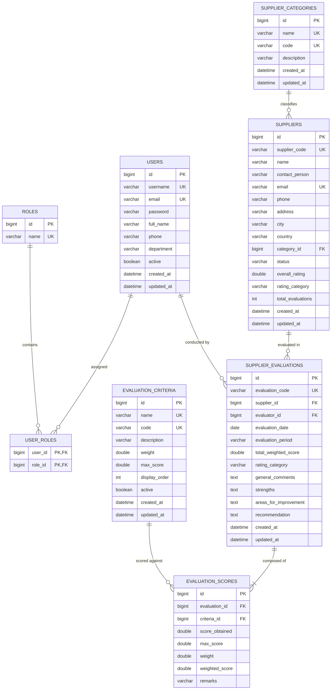

# Entity-Relationship (ER) Diagram

## 1. Database Schema Overview

The SPRS relational database schema manages entities with referential integrity, foreign key constraints, cascading rules, and optimized indexes.

---

## 2. Table Cardinalities & Business Rules
1. **User & Roles**: Many-to-Many (`users` $\leftrightarrow$ `roles` via `user_roles`).
2. **Category & Suppliers**: One-to-Many (`supplier_categories` $\to$ `suppliers`). A category can have many suppliers; deleting a category requires reassigning suppliers.
3. **Supplier & Evaluations**: One-to-Many (`suppliers` $\to$ `supplier_evaluations`). Deleting an evaluation automatically triggers a recalculation of the supplier's rolling average rating.
4. **Evaluation & Scores**: One-to-Many with Cascade Delete (`supplier_evaluations` $\to$ `evaluation_scores`). Deleting an evaluation removes its child score entries.
5. **Criteria & Scores**: One-to-Many (`evaluation_criteria` $\to$ `evaluation_scores`). Criteria definitions track historical scores.
